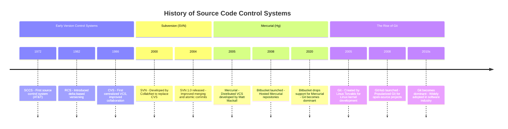

# History of Git

The history of source code control systems (Version Control Systems, or VCS) dates back to the early days of computing when developers needed ways to track and manage changes to source code efficiently. Here’s a high-level overview, with a focus on Subversion (SVN) and why Git was developed:

## **Early Version Control Systems**
1. **SCCS (Source Code Control System) - 1972**
    - One of the first VCS, developed by AT&T.
    - Used a file-locking mechanism, meaning only one developer could edit a file at a time.

2. **RCS (Revision Control System) - 1982**
    - Improved on SCCS by allowing concurrent edits but still worked on a per-file basis.
    - Used delta storage (storing changes instead of full copies).

3. **CVS (Concurrent Versions System) - 1986**
    - Allowed multiple developers to work on the same project.
    - Introduced centralized repositories and branching, but had issues with merging.

## **Subversion (SVN) - 2000**
- **Developed by CollabNet** as a successor to CVS to address its shortcomings.
- **Centralized Model:** A single server stored the entire codebase, and clients checked out and committed changes.
- **Atomic Commits:** Unlike CVS, SVN ensured that commits were all-or-nothing transactions.
- **Directory Versioning:** SVN tracked changes to directories, not just files.
- **Problems with SVN:**
    - **Centralized Nature:** If the server went down, developers couldn't commit changes.
    - **Merging and Branching were slow and cumbersome**, requiring full copies of files.
    - **Performance Issues:** Large repositories with many branches became sluggish.
    - **Offline Work Was Difficult:** Developers needed server access to commit changes.

## **Git - 2005**
- **Developed by Linus Torvalds** for the Linux kernel development.
- **Motivation:**
    - Linux development previously relied on **BitKeeper**, a proprietary VCS, which was discontinued for free use.
    - The kernel project needed a **fast, distributed, and scalable VCS** that allowed thousands of developers to collaborate.
- **Key Features of Git:**
    - **Distributed Version Control:** Every developer has a complete copy of the repository.
    - **Speed and Performance:** Git is optimized for fast branching, merging, and history traversal.
    - **Efficient Branching & Merging:** Branches are lightweight and merging is seamless.
    - **Offline Work:** Developers can commit, create branches, and work without a network connection.
    - **SHA-1 Hashing for Integrity:** Ensures data integrity by detecting corruption or tampering.

### **Why Git Replaced SVN in Many Projects**
- **Flexibility:** Developers can work independently without depending on a central server.
- **Better Collaboration:** Git’s branching model allows multiple contributors to work in parallel.
- **Speed:** Operations like checking logs, switching branches, and merging are much faster.
- **Resilience:** If a central Git server crashes, any developer with a full clone can restore the repository.

Mercurial (Hg) is another distributed version control system that shares many concepts with Git but hasn't gained the same level of popularity. Here’s a bit more information about Mercurial’s history and why it didn't rise to the same prominence as Git:

## **Mercurial (Hg) - 2005**
- **Developed by Matt Mackall** as a response to the need for a simpler, faster alternative to other version control systems like CVS and Subversion.
- **Key Features:**
    - **Distributed Version Control** like Git, meaning each developer has a full copy of the repository.
    - **Ease of Use** with a more user-friendly interface and simpler commands than Git.
    - **Performance:** Like Git, Mercurial was designed to handle large repositories efficiently.
    - **Cross-platform Support:** Mercurial worked on various platforms, including Windows, macOS, and Linux.
    - **Branching and Merging:** Mercurial had strong support for branching and merging, although some users felt it was not as powerful or flexible as Git’s.

## **Why Mercurial Didn’t Gain the Same Popularity as Git**
1. **Community and Ecosystem:**
    - **GitHub:** The launch of GitHub in 2008 made Git even more popular, as it became the go-to platform for hosting and collaborating on open-source projects. GitHub’s ecosystem of tools, integrations, and community support played a huge role in Git’s rise.
    - **Mercurial’s Ecosystem:** While Mercurial had Bitbucket and other hosting platforms, they never gained the same widespread adoption as GitHub. Bitbucket also shifted to supporting only Git in 2020, further diminishing Mercurial's visibility.

2. **Git's Flexibility and Power:**
    - Git’s flexibility, speed, and robust branching/merging capabilities appealed to large-scale, complex projects like Linux, where granular control over version history and performance were crucial.
    - Mercurial, while simpler to use, didn’t offer the same level of flexibility and control as Git, which made it less suitable for large-scale projects that required advanced versioning features.

3. **Adoption by Major Projects:**
    - Major open-source projects like the Linux kernel, Chromium, and many others chose Git, cementing it as the standard for open-source development.
    - Mercurial did gain traction in some large projects, such as Python, but these projects were fewer in number compared to Git’s growing list of adopters.

4. **Tooling and Integration:**
    - Git’s tooling ecosystem, including popular continuous integration/continuous deployment (CI/CD) tools, IDE integrations, and other developer tools, became much more widespread and feature-rich compared to Mercurial.

While Mercurial is still used in some legacy systems, **Git's ecosystem and community dominance** were key reasons for its widespread adoption. If you're discussing the landscape of VCS in your workshop, this could be a good talking point!

### **Conclusion**
While SVN is still used in some legacy projects, Git has become the dominant VCS due to its flexibility, speed, and suitability for modern software development practices, especially in open-source projects.

Would you like any specific comparisons between SVN and Git for your workshop?
