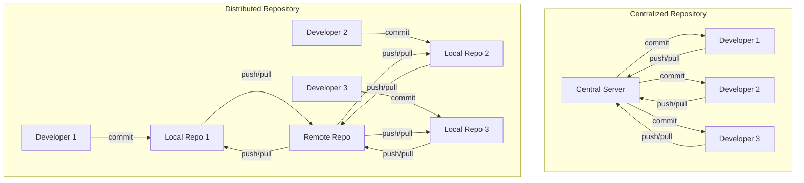

# Git Concepts

## **1. Introduction to Git Concepts**

### **What is Git? (Distributed version control vs. centralized)**
- Git is a **distributed version control system (DVCS)**, meaning every developer has a full copy of the repository locally.
- Subversion (SVN) is **centralized**, meaning all changes must go through a central server.
- With Git, users can work offline, commit locally, and later sync with a remote repository.



### **How Git stores changes (snapshots vs. diffs in Subversion)**
- SVN stores **differences (diffs)** between file versions.
- Git stores **snapshots** of the entire project at each commit, making branching and reverting more efficient.
- This model makes Git much faster for operations like checking history and switching branches.

### **Local vs. remote repositories**
- In Git, each developer has a **local repository**, a copy of the entire project with all history.
- A **remote repository** (hosted on GitHub, GitLab, Azure DevOps, etc.) allows collaboration.
- Developers sync changes via `git push` (uploading) and `git pull` (downloading).

### **Branching and merging (feature branches, main/master)**
- **Branches** allow parallel development without affecting the main code.
- SVN branches are **copies of directories** in the central repo, making them heavyweight.
- Git branches are **lightweight pointers** to commits, making switching between branches nearly instant.
- Merging integrates branches back into the main code, resolving conflicts if needed.

### **The Git workflow (working directory → staging area → commit)**
- **Working directory**: The files as they currently exist on disk.
- **Staging area (index)**: A place to prepare changes before committing.
- **Commit**: A saved snapshot of staged changes.
- This extra step (`git add`) allows selective commits, unlike SVN, which commits everything immediately.

---

## **2. Differences Between Git and Subversion**

### **No central repository required in Git**
- Developers don’t need constant internet access.
- Every user has a full repository, making Git faster and more resilient.

### **Commits are local in Git before pushing**
- SVN commits go directly to the central server.
- In Git, commits are **local** first (`git commit`), and developers push them later (`git push`).

### **Branching is lightweight in Git (unlike expensive SVN branches)**
- SVN branches require copying files on the server.
- Git branches are **just pointers to commits**, making them nearly instant to create.

### **Merge vs. rebase (SVN users are often unfamiliar with rebase)**
- SVN merges are often manual and may require extra conflict resolution.
- Git supports **fast-forward merges** when no diverging commits exist.
- `git rebase` moves commits onto a new base, helping maintain a linear history.

### **Handling binary files and large files (Git LFS)**
- SVN handles binary files well since it stores diffs.
- Git struggles with binary files due to its snapshot model.
- **Git LFS (Large File Storage)** allows handling large files efficiently.

---

## **3. Daily Git Commands**

### **`git clone` (Equivalent of `svn checkout`)**
- Copies a remote repository to a local machine.
- Example:
  ```sh
  git clone https://github.com/user/repo.git
  ```
- Unlike `svn checkout`, `git clone` includes the full history.

### **`git pull` (Fetching latest changes)**
- Fetches and integrates changes from the remote repository.
- Example:
  ```sh
  git pull origin main
  ```

### **`git status` (Checking changes)**
- Shows modified, staged, and untracked files.
- Example:
  ```sh
  git status
  ```

### **`git add` (Staging changes)**
- Moves files from the working directory to the staging area.
- Example:
  ```sh
  git add file.txt
  git add .
  ```

### **`git commit -m "message"` (Saving changes)**
- Records a snapshot of staged changes.
- Example:
  ```sh
  git commit -m "Fixed bug in login form"
  ```

### **`git push` (Pushing changes)**
- Uploads local commits to a remote repository.
- Example:
  ```sh
  git push origin main
  ```

### **`git log` (Viewing commit history)**
- Shows commit history.
- Example:
  ```sh
  git log --oneline --graph
  ```

### **`git diff` (Checking differences)**
- Shows changes between commits or working directory and staging.
- Example:
  ```sh
  git diff
  ```

---

## **4. Advanced Git Commands**

### **Branching: `git branch`, `git checkout -b`, `git switch`**
- Creates a new branch:
  ```sh
  git branch feature-branch
  ```
- Switches to a branch:
  ```sh
  git switch feature-branch  # Newer command
  ```
  (or)
  ```sh
  git checkout feature-branch  # Older method
  ```
- Creates and switches:
  ```sh
  git switch -c feature-branch
  ```

### **Merging: `git merge`, resolving conflicts**
- Merges a branch into the current branch:
  ```sh
  git merge feature-branch
  ```
- If conflicts occur, Git highlights them in files.

### **Rebasing: `git rebase`, interactive rebase (`git rebase -i`)**
- Moves commits onto another branch:
  ```sh
  git rebase main
  ```
- Interactive rebase allows editing history:
  ```sh
  git rebase -i HEAD~3
  ```

### **Stashing: `git stash`**
- Saves changes temporarily:
  ```sh
  git stash
  ```
- Restores the stashed changes:
  ```sh
  git stash pop
  ```

### **Resetting & Reverting: `git reset --soft/hard`, `git revert`**
- Moves HEAD and uncommits:
  ```sh
  git reset --soft HEAD~1  # Keep changes
  git reset --hard HEAD~1  # Remove changes
  ```
- Reverts a commit without modifying history:
  ```sh
  git revert <commit-hash>
  ```

### **Cherry-picking: `git cherry-pick`**
- Applies a specific commit from another branch:
  ```sh
  git cherry-pick <commit-hash>
  ```

### **Rewriting history: `git commit --amend`, `git rebase -i`**
- Modifies the last commit:
  ```sh
  git commit --amend -m "Updated commit message"
  ```
- Rewrites multiple commits:
  ```sh
  git rebase -i HEAD~3
  ```

### **Working with remotes: `git remote`, `git fetch`, `git push --force-with-lease`**
- Lists remotes:
  ```sh
  git remote -v
  ```
- Fetches without merging:
  ```sh
  git fetch
  ```
- Safe force push:
  ```sh
  git push --force-with-lease
  ```

---

## **5. Best Practices and Troubleshooting**

### **Writing meaningful commit messages**
- Follow the convention: `type(scope): message`
  ```
  feat(auth): Add login feature
  fix(cart): Correct checkout bug
  ```

### **Keeping branches short-lived**
- Merge feature branches quickly to avoid conflicts.

### **Avoiding force pushes on shared branches**
- Only use `--force-with-lease` to prevent data loss.

### **Using `.gitignore` effectively**
- Ignore unnecessary files (e.g., logs, temp files):
  ```
  node_modules/
  .env
  ```

### **Handling conflicts efficiently**
- Use `git merge` or `git rebase` and resolve conflicts in files.

---

