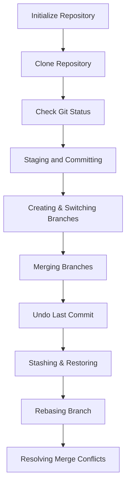
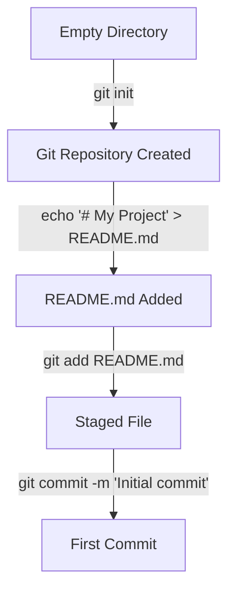
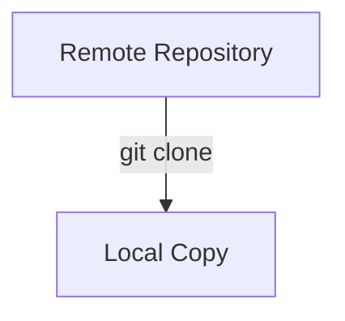
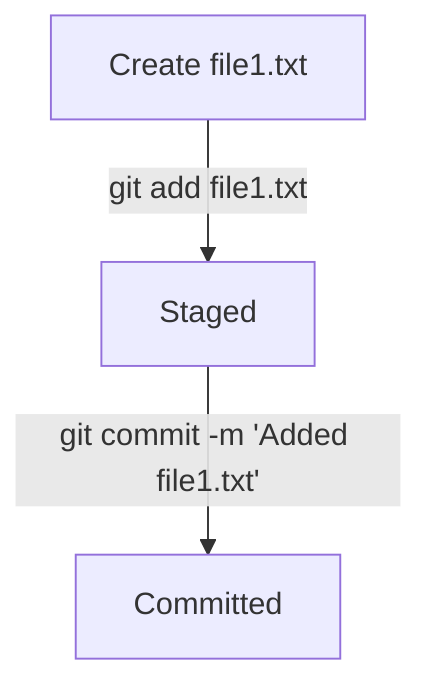
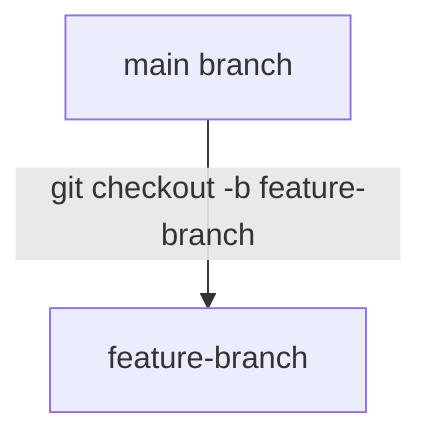
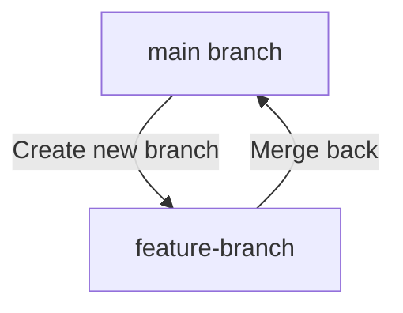
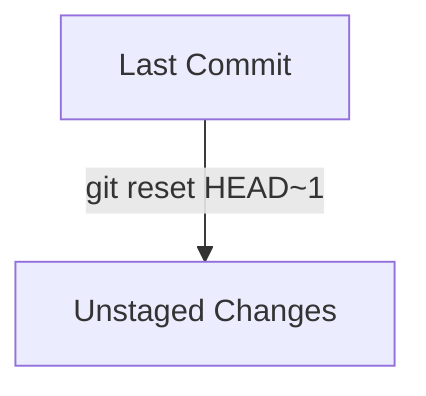
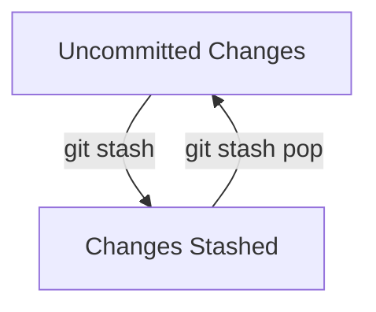
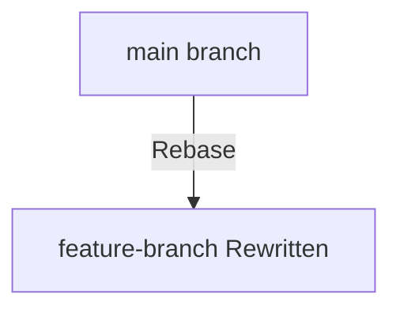
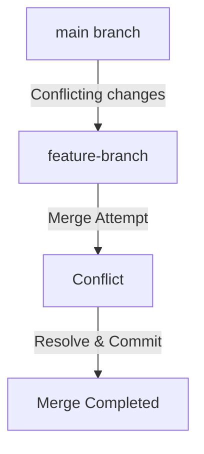

# **Basic Git Exercises (1-10)**



## **Exercise 1: Initializing a Repository**



### **Starting Point Setup**
```sh
mkdir my-git-project && cd my-git-project  
```

### **Goal**
Initialize a Git repository and make the first commit.

### **Commands**
```sh
git init  
echo "# My Project" > README.md  
git add README.md  
git commit -m "Initial commit"  
```

### **Verification**
```sh
git status  # Should show a clean working directory  
git log --oneline  # Should show the initial commit  
```

---

## **Exercise 2: Cloning a Repository**



### **Starting Point Setup**
Create a remote repository on GitHub/GitLab.

### **Goal**
Clone the repository locally.

### **Commands**
```sh
git clone <repository-url>  
```

### **Verification**
```sh
ls -la <repo-name>  # Should list all files  
cd <repo-name> && git status  
```

---

## **Exercise 3: Tracking Changes with Git Status**
### **Starting Point Setup**
```sh
echo "Some content" > file.txt  
```

### **Goal**
Check the status of your working directory.

### **Commands**
```sh
git status  
```

### **Verification**
Git should show `file.txt` as untracked.

---

## **Exercise 4: Staging and Committing Changes**



### **Starting Point Setup**
```sh
echo "Hello, Git!" > file1.txt  
git add file1.txt  
git commit -m "Added file1.txt"  
```

### **Goal**
Make another change and commit it.

### **Commands**
```sh
echo "New content" >> file1.txt  
git add file1.txt  
git commit -m "Updated file1.txt"  
```

### **Verification**
```sh
git log --oneline -n 2  
```

---

## **Exercise 5: Creating and Switching Branches**



### **Starting Point Setup**
```sh
git checkout -b feature-branch  
```

### **Goal**
Confirm that you've switched branches.

### **Commands**
```sh
git branch  # Should list 'feature-branch' and 'main'  
git checkout main  
```

---

## **Exercise 6: Merging a Branch**



### **Starting Point Setup**
```sh
git checkout -b new-feature  
echo "Feature work" > feature.txt  
git add feature.txt  
git commit -m "Added feature.txt"  
git checkout main  
```

### **Goal**
Merge `new-feature` into `main`.

### **Commands**
```sh
git merge new-feature  
git branch -d new-feature  
```

### **Verification**
```sh
git log --oneline --graph  
```

---

## **Exercise 7: Undoing the Last Commit**



### **Starting Point Setup**
```sh
echo "Temporary change" > temp.txt  
git add temp.txt  
git commit -m "Temporary commit"  
```

### **Goal**
Undo the last commit but keep changes.

### **Commands**
```sh
git reset HEAD~1  
```

### **Verification**
```sh
git status  
```

---

## **Exercise 8: Stashing and Restoring Changes**



### **Starting Point Setup**
```sh
echo "Work in progress" > wip.txt  
git add wip.txt  
```

### **Goal**
Stash changes, switch branches, and restore them.

### **Commands**
```sh
git stash  
git checkout main  
git checkout -b another-branch  
git stash pop  
```

### **Verification**
```sh
ls  
```

---

## **Exercise 9: Rebasing a Feature Branch**



### **Starting Point Setup**
```sh
git checkout -b rebase-branch  
echo "Rebase test" > rebase.txt  
git add rebase.txt  
git commit -m "Added rebase.txt"  
git checkout main  
echo "Main branch update" > main.txt  
git add main.txt  
git commit -m "Updated main"  
git checkout rebase-branch  
```

### **Goal**
Rebase `rebase-branch` onto `main`.

### **Commands**
```sh
git rebase main  
```

### **Verification**
```sh
git log --oneline --graph  
```

---

## **Exercise 10: Resolving Merge Conflicts**



### **Starting Point Setup**
```sh
git checkout -b conflict-branch  
echo "Hello" > conflict.txt  
git add conflict.txt  
git commit -m "Created conflict.txt"  
git checkout main  
echo "Hello, World!" > conflict.txt  
git add conflict.txt  
git commit -m "Updated conflict.txt in main"  
git checkout conflict-branch  
```

### **Goal**
Merge `main` and resolve conflicts.

### **Commands**
```sh
git merge main  
# Manually resolve conflicts in conflict.txt  
git add conflict.txt  
git commit -m "Resolved conflict"  
```

### **Verification**
```sh
git log --oneline --graph  
```

---
