# **Intermediate Git Exercises (11-20)**

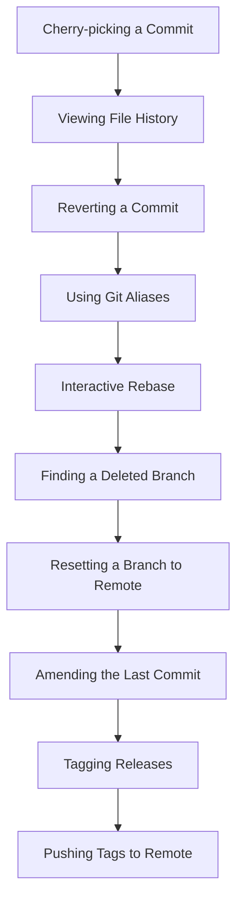

---

## **Exercise 11: Cherry-picking Commits**

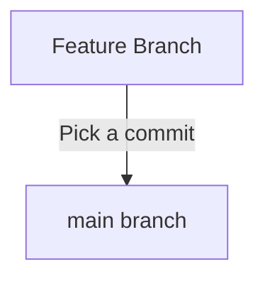

### **Starting Point Setup**
```sh
git checkout -b cherry-pick-branch  
echo "First commit" > file.txt  
git add file.txt  
git commit -m "Commit A"  
echo "Second commit" >> file.txt  
git commit -am "Commit B"  
echo "Third commit" >> file.txt  
git commit -am "Commit C"  
git checkout main  
```

### **Goal**
Cherry-pick a commit from `cherry-pick-branch` into `main`.

### **Commands**
```sh
git cherry-pick <commit-hash>  
```

### **Verification**
```sh
git log --oneline  
```

---

## **Exercise 12: Viewing File History**

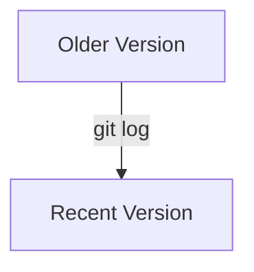

### **Starting Point Setup**
```sh
echo "File history test" > history.txt  
git add history.txt  
git commit -m "Initial commit"  
echo "Updated content" >> history.txt  
git commit -am "Modified history.txt"  
```

### **Goal**
View the commit history of a file.

### **Commands**
```sh
git log --oneline history.txt  
```

### **Verification**
```sh
git blame history.txt  
```

---

## **Exercise 13: Reverting a Commit**

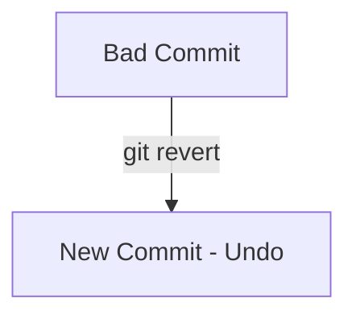

### **Starting Point Setup**
```sh
echo "Revert this change" > revert.txt  
git add revert.txt  
git commit -m "Bad commit"  
```

### **Goal**
Revert the last commit without removing the file.

### **Commands**
```sh
git revert HEAD  
```

### **Verification**
```sh
git log --oneline  
```

---

## **Exercise 14: Using Git Aliases**

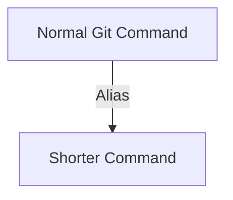

### **Goal**
Create a shortcut for frequently used commands.

### **Commands**
```sh
git config --global alias.last 'log -1 HEAD'  
```

### **Verification**
```sh
git last  
```

---

## **Exercise 15: Interactive Rebase (Squashing Commits)**
(Same as Exercise 11 but squashing multiple commits.)

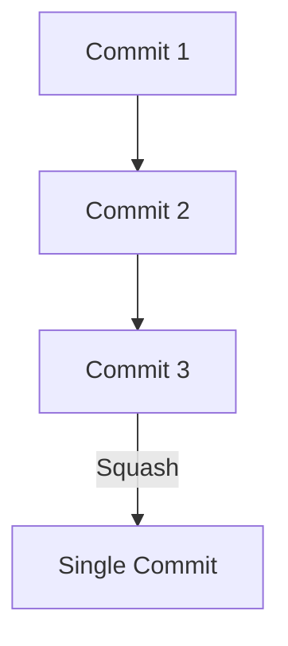

---

## **Exercise 16: Finding a Deleted Branch**

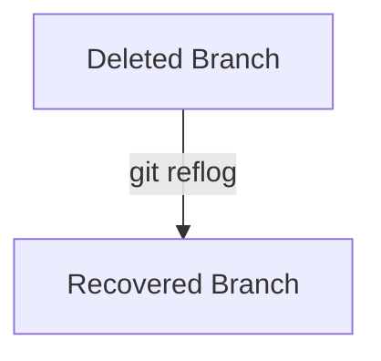

### **Starting Point Setup**
```sh
git checkout -b recover-branch  
touch recover.txt  
git add recover.txt  
git commit -m "Work in progress"  
git checkout main  
git branch -D recover-branch  
```

### **Goal**
Recover the deleted branch.

### **Commands**
```sh
git reflog  
git checkout -b recover-branch <commit-hash>  
```

---

## **Exercise 17: Resetting a Branch to Remote**

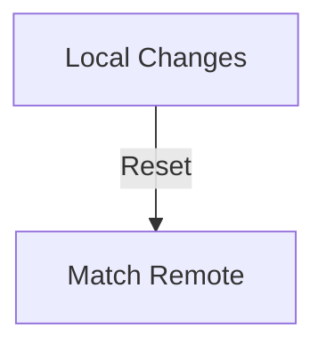

### **Goal**
Reset local changes and match remote.

### **Commands**
```sh
git fetch origin  
git reset --hard origin/main  
```

---

## **Exercise 18: Amending the Last Commit**

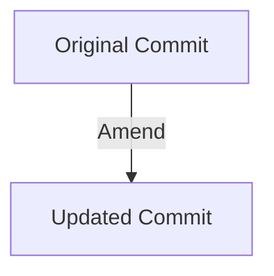

### **Goal**
Modify the last commit message.

### **Commands**
```sh
git commit --amend -m "Updated commit message"  
```

---

## **Exercise 19: Tagging Releases**

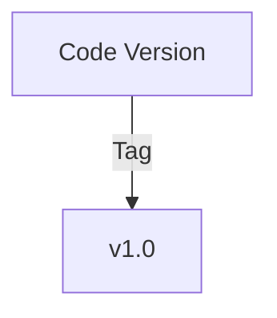

### **Goal**
Create an annotated tag.

### **Commands**
```sh
git tag -a v1.0 -m "Version 1.0 release"  
```

### **Verification**
```sh
git tag  
```

---

## **Exercise 20: Pushing Tags to Remote**

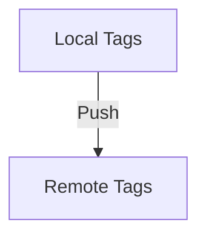

### **Goal**
Push tags to a remote repository.

### **Commands**
```sh
git push origin --tags  
```

---

