# **Advanced Git Exercises (21-30)**

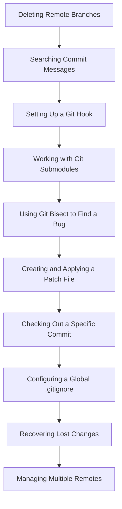

---

## **Exercise 21: Deleting Remote Branches**

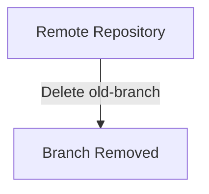

### **Goal**
Delete a remote branch.

### **Commands**
```sh
git push origin --delete old-branch  
```

---

## **Exercise 22: Searching Commit Messages**

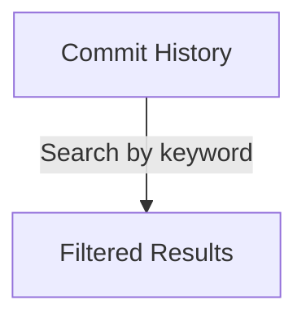

### **Goal**
Find a commit by message keyword.

### **Commands**
```sh
git log --grep="fix"  
```

---

## **Exercise 23: Setting Up a Git Hook**

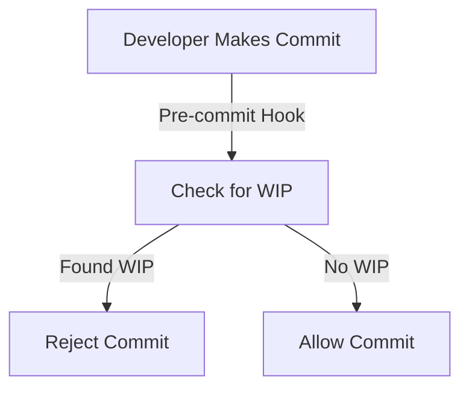

### **Goal**
Create a pre-commit hook to prevent commits with "WIP".

### **Commands**
```sh
echo 'if git diff --cached | grep -q "WIP"; then exit 1; fi' > .git/hooks/pre-commit  
chmod +x .git/hooks/pre-commit  
```

---

## **Exercise 24: Working with Git Submodules**

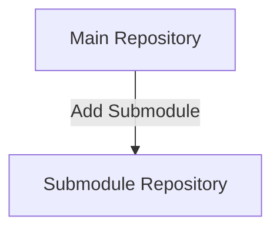

### **Goal**
Add a submodule to a project.

### **Commands**
```sh
git submodule add <repo-url> submodule-folder  
```

---

## **Exercise 25: Using Git Bisect to Find a Bug**

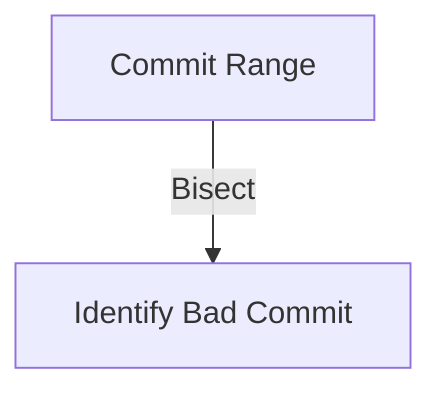

### **Starting Point Setup**
```sh
echo "Good version" > test.txt  
git commit -am "Good commit"  
echo "Bug introduced" > test.txt  
git commit -am "Bad commit"  
```

### **Goal**
Find the buggy commit.

### **Commands**
```sh
git bisect start  
git bisect bad  
git bisect good HEAD~1  
```

---

## **Exercise 26: Creating and Applying a Patch File**

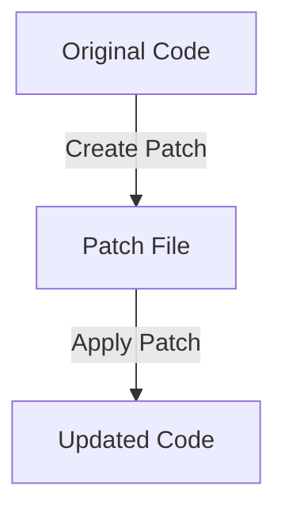

### **Goal**
Create a patch and apply it to another repo.

### **Commands**
```sh
git diff > my-changes.patch  
git apply my-changes.patch  
```

---

## **Exercise 27: Checking Out a Specific Commit**

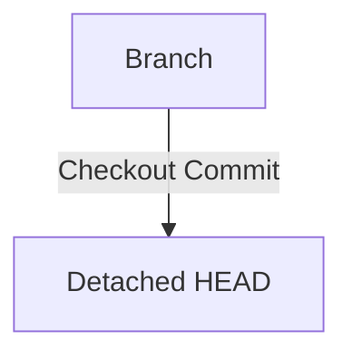

### **Goal**
View the state of an old commit.

### **Commands**
```sh
git checkout <commit-hash>  
```

---

## **Exercise 28: Configuring a Global `.gitignore` File**

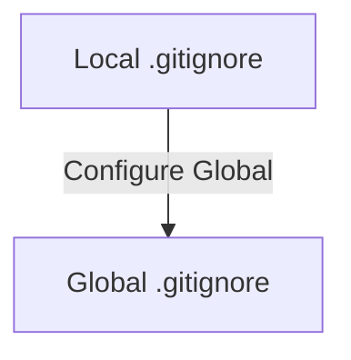

### **Goal**
Apply `.gitignore` globally.

### **Commands**
```sh
echo "*.log" >> ~/.gitignore_global  
git config --global core.excludesfile ~/.gitignore_global  
```

---

## **Exercise 29: Recovering Lost Changes Using the Reflog**

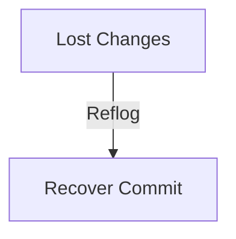

### **Starting Point Setup**
```sh
echo "Recover me" > lost.txt  
git add lost.txt  
git commit -m "Lost commit"  
git reset --hard HEAD~1  
```

### **Goal**
Recover the lost commit.

### **Commands**
```sh
git reflog  
git checkout <commit-hash>  
```

---

## **Exercise 30: Managing Multiple Remotes**

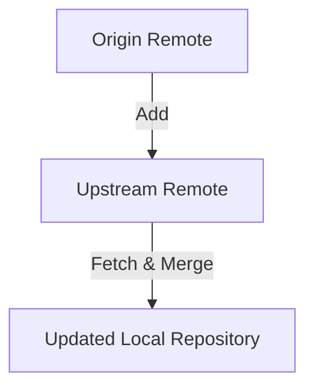

### **Goal**
Add a second remote repository.

### **Commands**
```sh
git remote add upstream <repo-url>  
git fetch upstream  
git merge upstream/main  
```

---
