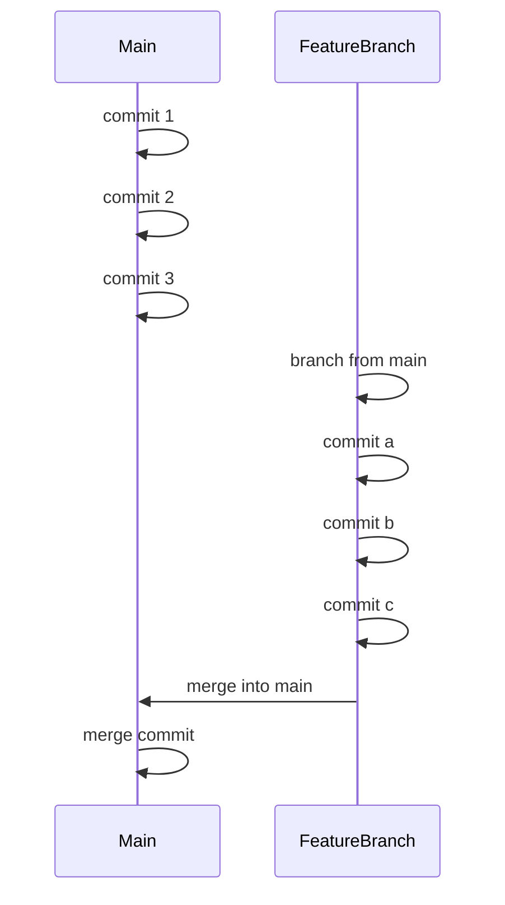
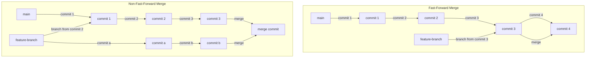
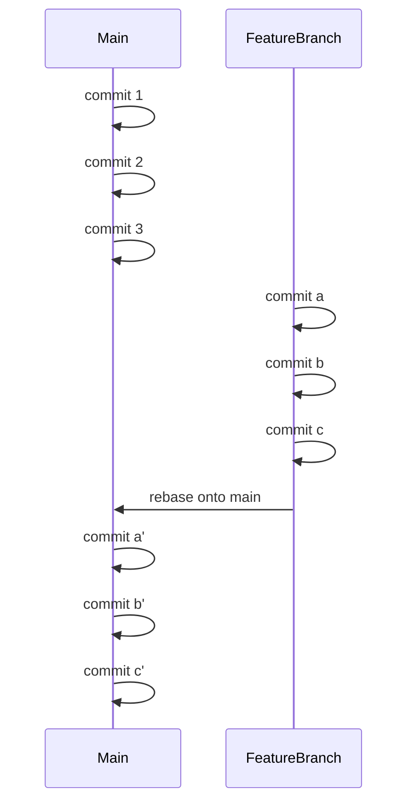
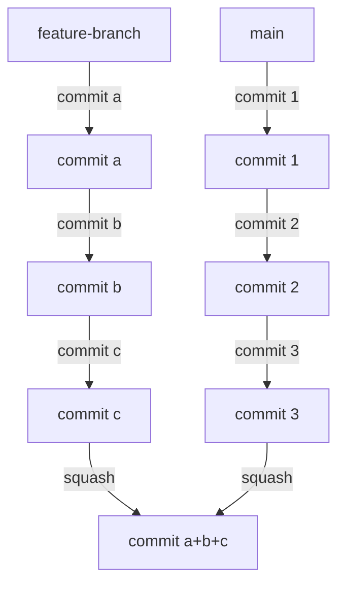

# Merge, Rebase and Squash

### **Merge, Rebase, and Squash in Git – Detailed Explanation**

When working with Git, you often need to integrate changes from one branch into another. Git provides multiple ways to do this, with **merge**, **rebase**, and **squash** being three key techniques. Each has its own use case and effect on the commit history.

---

## **1. Merge**



### **What is Merge?**
Merging combines the changes from two branches into one, preserving the commit history of both branches. When you merge a branch (e.g., `feature-branch`) into another branch (e.g., `main`), Git creates a **new merge commit** that ties together the history of both branches.

### **Types of Merge**
#### **a) Fast-forward Merge**



- Happens when the target branch (`main`) has not diverged from the feature branch (`feature-branch`).
- Git simply moves the branch pointer forward.
- No new merge commit is created.

  **Example:**
  ```bash
  git checkout main
  git merge feature-branch
  ```

  If `main` has no new commits since `feature-branch` branched off, Git will just move the `main` pointer forward.

#### **b) Three-way Merge (Non-fast-forward Merge)**
- Occurs when both branches have new commits, creating a new **merge commit**.
- Preserves commit history from both branches.

  **Example:**
  ```bash
  git checkout main
  git merge feature-branch
  ```

  **Pros of Merge:**
    - Retains full commit history.
    - Clearly shows branch structure.

  **Cons of Merge:**
    - Can lead to cluttered history with many merge commits.
    - Merge conflicts may arise if both branches modified the same lines.

---

## **2. Rebase**



### **What is Rebase?**
Rebasing moves a branch to a new base by **applying** its commits on top of another branch’s latest state. Instead of a merge commit, rebase rewrites commit history.

### **Example of Rebase**
You are on `feature-branch` and want to rebase it onto `main`:

```bash
git checkout feature-branch
git rebase main
```

This **moves** all commits from `feature-branch` to the tip of `main`, replaying them one by one.

### **Pros of Rebase:**
- Creates a **clean, linear history** without extra merge commits.
- Makes `git log` and `git bisect` easier to use.

### **Cons of Rebase:**
- **Rewrites commit history** (not safe for shared branches).
- Can be confusing for beginners.
- May require resolving conflicts **multiple times** if there are conflicts in multiple commits.

### **Interactive Rebase**
You can modify commits interactively using:

```bash
git rebase -i main
```

This allows you to:
- **Reorder commits**
- **Squash commits together**
- **Edit commit messages**
- **Drop commits**

---

## **3. Squash**



### **What is Squash?**
Squashing combines multiple commits into **one single commit**. It is often used during rebasing or merging to simplify commit history.

### **Example: Squashing during an Interactive Rebase**
```bash
git rebase -i HEAD~3  # Squash the last 3 commits
```
In the interactive editor, change:
```
pick 1234567 First commit
pick 89abcd2 Second commit
pick fedcba3 Third commit
```
To:
```
pick 1234567 First commit
squash 89abcd2 Second commit
squash fedcba3 Third commit
```
After saving, Git will prompt for a new commit message.

### **Example: Squash on Merge**
You can merge a feature branch and squash its commits into a single commit using:
```bash
git merge --squash feature-branch
git commit -m "Merged feature-branch in a single commit"
```

### **Pros of Squash:**
- Creates a **clean history** with a single commit per feature.
- Reduces noise in the commit log.

### **Cons of Squash:**
- **Loses granular commit history** from the feature branch.
- Harder to track individual changes later.

---

## **When to Use Merge, Rebase, or Squash?**
| **Scenario** | **Merge** | **Rebase** | **Squash** |
|-------------|----------|-----------|----------|
| **Preserve full history** | ✅ Yes | ❌ No (rewrites history) | ❌ No |
| **Linear history (no merge commits)** | ❌ No | ✅ Yes | ✅ Yes |
| **Integrating changes from main into a feature branch** | ✅ Yes | ✅ Yes | ❌ No |
| **Integrating a completed feature branch into main** | ✅ Yes (if history matters) | ✅ Yes (if linear history is required) | ✅ Yes (if a single commit is preferred) |
| **Working in a shared/public branch** | ✅ Yes | ❌ No (dangerous) | ❌ No |
| **Keeping a clean commit history in a feature branch before merging** | ❌ No | ✅ Yes | ✅ Yes |

---

## **Summary**
- **Merge**: Preserves history but adds extra merge commits.
- **Rebase**: Creates a clean linear history but rewrites commits.
- **Squash**: Combines multiple commits into one for a clean history but loses commit granularity.

Would you like a hands-on Git example or a diagram to visualize this better? 😊