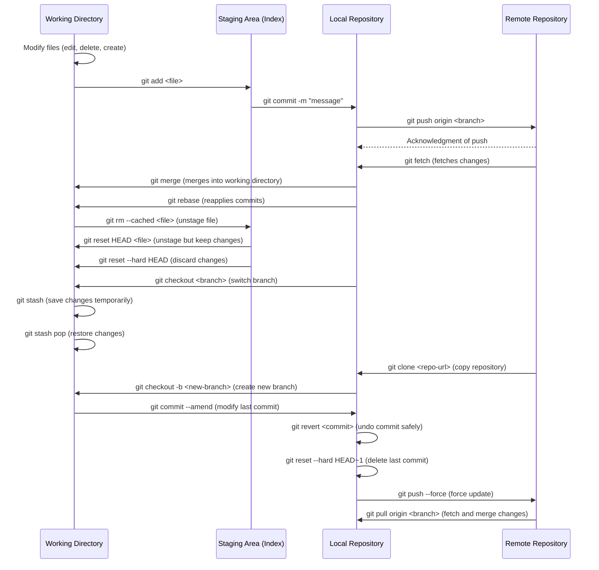
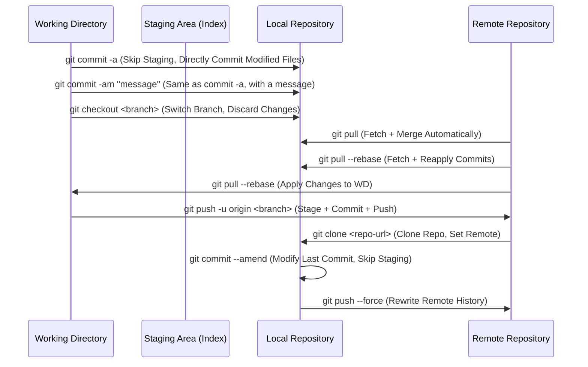

# Working Directory, Staging Area, Local Repository, Remote Repository

Here's a sequence diagram that visualizes the interaction between the Working Directory, Staging Area (Index), Local Repository, and Remote Repository, along with common Git commands.

## **Git Workflow Stages**:

## Shortcuts and Tips

Here's a **Mermaid sequence diagram** that highlights Git commands that **jump stages** in the workflow between the **Working Directory (WD)**, **Staging Area (SA)**, **Local Repository (LR)**, and **Remote Repository (RR)**.

---

---

### **Key Takeaways from the Diagram**:
- **`git commit -a`** skips the **Staging Area** and directly commits changes from the **Working Directory** to the **Local Repository**.
- **`git pull`** fetches changes from the **Remote Repository** and merges them into the **Local Repository** in one step.
- **`git push -u origin <branch>`** stages, commits, and pushes in a single command (if combined with `-a`).
- **`git commit --amend`** modifies the last commit directly without re-staging.
- **`git pull --rebase`** fetches and reapplies local commits on top of the latest changes.

---
